Differential Expression Analysis by DESeq2
================
Narayanan Raghupathy, The Jackson Laboratory
October 29, 2017, RNA-seq workshop at 21st Century Mouse Genetics 2017

One of the most common applications of RNA-seq technology is using it for identifying genes that are differentially expressed between sample groups. Typical examples include differential expression analysis between wild type and mutant samples, or cancer vs normal samples.

Let us assume that we have quantified total gene expression for all known genes using RNA-seq analysis pipeline discussed earlier for Diversity Outbred mouse populations under different diets.

We will be using read counts at gene level and the software tool **DESeq2** for doing differential expression analysis on a subset of the DO mice.

Our goals of this exercise are

-   find the genes that are differentially expressed between DO mice under standard **Chow diet** and **High fat diet** in

-   see the **effect of sample size** on detecting differentially expressed genes.

Setup
-----

``` r
#install.packages(pkgs = c("ggplot2", "dplyr","tibble"))
#source("https://bioconductor.org/biocLite.R")
#biocLite(pkgs = c("DESeq2", "limma"))
```

R Libraries and Data Import
---------------------------

#### Load packages

Let us load the R packages and the data needed for the differential expression analysis.

``` r
library(DESeq2)
library(ggplot2)
library(dplyr)
library(tibble)
library(limma)
```

#### Load gene information

Let us load the data file containing basic gene information that are used in the analysis.

``` r
gene_info=read.csv(url("ftp://ftp.jax.org/dgatti/ShortCourse2015/ENSMUSG-gene-info-R84.tsv"),header=FALSE,sep="\t")
colnames(gene_info)=c("gene_id","gene_name","chr","strand","start","end")
head(gene_info)
```

#### Load R Data files

Let us load the R object files containing expression data and experimental design information needed for doing differential expression analysis.

``` r
load("data/ChickMungeretal2016_DiversityOutbred.rdata")
load("data/DO192_RNAseq_EMASE_RawCounts.rdata")
```

#### Data munging

Let us munge the data :-)

``` r
exp_all= t(expr.rna.192.rawcounts)
exp_design=data.frame(Sample_ID=rownames(covariates.rna.192),covariates.rna.192,stringsAsFactors = FALSE)
head(exp_design)
exp_all[1:5,1:5]
exp_design[1:5,]
```

``` r
exp_design=covariates.rna.192  %>% 
        select(Diet,Sex) %>%   rownames_to_column('Sample_ID')
### print few rows of the exp_design 
head(exp_design)
```

    ##   Sample_ID Diet Sex
    ## 1      F326 chow   F
    ## 2      F327 chow   F
    ## 3      F328 chow   F
    ## 4      F329 chow   F
    ## 5      F330 chow   F
    ## 6      F331 chow   F

Let us check the samples in the expression data and design data are in the same order.

``` r
all(colnames(exp_all)==exp_design$sample_ID)
```

### Code Challenge

1.  Find the number of samples in the data set.
2.  Find the number of genes in the study

A quick check for sample mixup
------------------------------

Let us do a quick sample mixup check using **Xist** gene expression. Xist is non-coding RNA expressed in females.

Let us plot **Xist** expression in all samples against sex.

``` r
plot_exp <- function(exp_design, gexp, g_id, g_info, variable="Sex"){
      # plots gene expression (raw) counts by Sex variable
      # Arguments:
      #    exp_design: experimental design data frame containing
      #                sample IDs, Diet and Sex information           
      #    gexp:       gene expression data  
      #    g_id:       ensembl gene ID
      #    variable:   variable to plot
      # Output:
      #     gene expression plot 
      #
      if (g_id %in% rownames(gexp)){
        g_ind = which(as.vector(g_info$gene_id)==g_id)
        g_name = as.vector(g_info$gene_name)[g_ind]
        chro = as.vector(g_info$chr)[g_ind]
        g_index = which(rownames(gexp)==g_id)
        exp_data= data.frame(exp_design, 
                     exp=as.numeric(gexp[g_index,]))
        if (variable=="Sex"){
            p <- ggplot(exp_data,aes(x=Sex,y=exp)) 
            p <- p + geom_point(position = position_jitter(width = 0.2),size=3,
                    aes(colour = Sex))
        }else{
            p <- ggplot(exp_data,aes(x=Diet,y=exp)) 
            p <- p + geom_point(position = position_jitter(width = 0.2),size=3,
                    aes(colour = Diet))
        }
        p <- p + stat_summary(fun.y=mean, geom="point", shape=5, size=4)
        p <- p + ylab("Gene Expression (Read Counts)")
        p <- p + theme(axis.text=element_text(size=12),
                axis.title=element_text(size=12,face="bold", 
                                        colour = "blue"),
                plot.title = element_text(size = rel(1.5)))
        p <- p + ggtitle(paste0(g_id,": ",g_name," Chr",chro))
        print(p)
      }else{
        print(paste0(gene_id, " not expressed"))
      }
}
```

``` r
### Xist ensembl ID
gene_id='ENSMUSG00000086503'
### plot Xist expression by Sex using the function
plot_exp(exp_design, exp_all, gene_id,gene_info)
```

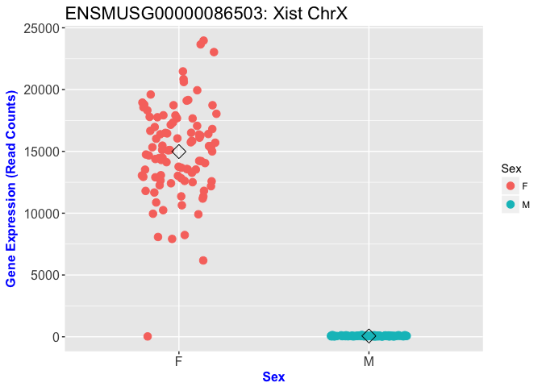

``` r
plot_exp(exp_design, exp_all, gene_id,gene_info,variable="Diet")
```

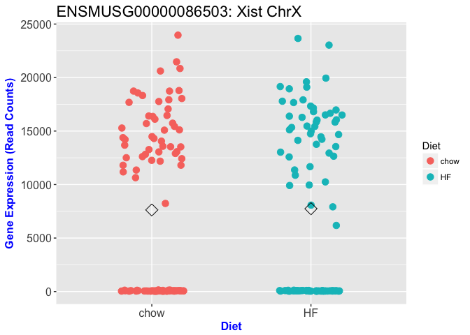

``` r
gene_id='ENSMUSG00000025907'
plot_exp(exp_design, exp_all, gene_id, gene_info)
```

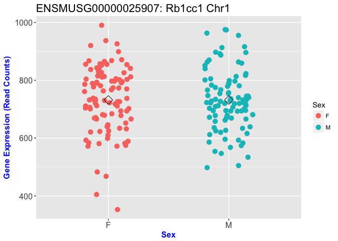

### Code Challenge

Pick your favorite gene (use ensembl ID) and plot its expression by

1.  Sex
2.  Diet.

Differential Expression Analysis with **three** samples in each group
---------------------------------------------------------------------

Let us start with an example identifying the genes that are differentially expressed between two diets **Chow** and **High fat**.

Let us first get the sample IDs (mouse IDs).

``` r
head(exp_design)
exp_design
male_chow_ids= exp_design %>% filter(Sex=='M' & Diet=='chow') %>% pull(Sample_ID) 
male_chow_ids
male_hf_ids = exp_design %>% filter(Sex=='M' & Diet=='HF') %>% pull(Sample_ID)
```

To make the example simple, let us subset our expression data such that we have **3 Male DO mice** under **Chow diet** and 3 DO mice under **High Fat diet**.

``` r
sampleSize = 3
```

Later on we will see the effect of sample size by changing it to **10**.

``` r
diet_3 = c(male_chow_ids[1:sampleSize],male_hf_ids[1:sampleSize])
exp_design_diet_3 = exp_design %>% filter(Sample_ID %in% diet_3)
exp_diet_3=exp_all[,diet_3]
all(colnames(exp_diet_3)==as.vector(exp_design_diet_3$Sample_ID))
```

    ## [1] TRUE

``` r
as.data.frame(head(exp_diet_3))
```

    ##                         M326        M327      M328      M351      M352
    ## ENSMUSG00000051951    2.0000    0.000000    0.0000    1.0000    1.0000
    ## ENSMUSG00000025902   28.0000   30.000000   22.0000   29.0000   29.0000
    ## ENSMUSG00000098104    0.0000    1.025781    0.0000    0.0000    0.0000
    ## ENSMUSG00000033845  705.0000  634.006421  630.0000  455.9880  493.0000
    ## ENSMUSG00000025903 2637.2729 2587.214344 2470.1066 1734.1035 2078.5513
    ## ENSMUSG00000033813  978.4619 1108.673719  853.0824  652.5509  806.0604
    ##                         M353
    ## ENSMUSG00000051951    1.0000
    ## ENSMUSG00000025902   40.0000
    ## ENSMUSG00000098104    0.0000
    ## ENSMUSG00000033845  570.9945
    ## ENSMUSG00000025903 2393.5206
    ## ENSMUSG00000033813  676.5410

``` r
dim(exp_diet_3)
```

    ## [1] 21122     6

Let us filter out genes with zero and low expression.

``` r
threshold = 200
exp_mat_diet_3= as.data.frame(exp_diet_3) %>%
    rownames_to_column('gene_id') %>%
    filter(rowSums(.[,2:7], na.rm=TRUE)>threshold) %>%
    column_to_rownames('gene_id')
dim(exp_mat_diet_3)
head(exp_mat_diet_3)
```

Differential expression analysis with DESeq2
--------------------------------------------

Let us create data frames for **DESeq2** object

``` r
### colData contains the condition/group information for Differenetial expression analysis
colData <- DataFrame(group = factor(exp_design_diet_3$Diet))
```

``` r
### Create DESeq2 object using expression and colData
dds_3reps <- DESeqDataSetFromMatrix(countData = as.data.frame(round(exp_mat_diet_3)),
         colData = colData, design = ~ group)
dds_3reps <- DESeq(dds_3reps)
res_3reps = results(dds_3reps)
resOrdered_3reps <- res_3reps[order(res_3reps$padj),]
head(resOrdered_3reps)
```

    ## log2 fold change (MLE): group HF vs chow 
    ## Wald test p-value: group HF vs chow 
    ## DataFrame with 6 rows and 6 columns
    ##                     baseMean log2FoldChange     lfcSE      stat
    ##                    <numeric>      <numeric> <numeric> <numeric>
    ## ENSMUSG00000073940 315.30932       2.373692 0.2394648  9.912490
    ## ENSMUSG00000031906 260.66920       4.267082 0.4355568  9.796842
    ## ENSMUSG00000068037  90.69700       3.130446 0.3618463  8.651314
    ## ENSMUSG00000071176 101.04051       2.402549 0.2852567  8.422413
    ## ENSMUSG00000052305 832.10546       2.163156 0.2817990  7.676237
    ## ENSMUSG00000005220  76.79766       4.457200 0.5914271  7.536347
    ##                          pvalue         padj
    ##                       <numeric>    <numeric>
    ## ENSMUSG00000073940 3.673735e-23 4.093275e-19
    ## ENSMUSG00000031906 1.161600e-22 6.471275e-19
    ## ENSMUSG00000068037 5.090991e-18 1.890794e-14
    ## ENSMUSG00000071176 3.688093e-17 1.027318e-13
    ## ENSMUSG00000052305 1.638293e-14 3.650772e-11
    ## ENSMUSG00000005220 4.833183e-14 8.975221e-11

DE Analysis summary with **3** samples per group
------------------------------------------------

``` r
### summary of Differential Expression analysis
summary(res_3reps)
```

    ## 
    ## out of 11188 with nonzero total read count
    ## adjusted p-value < 0.1
    ## LFC > 0 (up)     : 275, 2.5% 
    ## LFC < 0 (down)   : 193, 1.7% 
    ## outliers [1]     : 46, 0.41% 
    ## low counts [2]   : 0, 0% 
    ## (mean count < 32)
    ## [1] see 'cooksCutoff' argument of ?results
    ## [2] see 'independentFiltering' argument of ?results

``` r
sig_genes_3reps = as.data.frame(res_3reps) %>% 
                  rownames_to_column('gene_id') %>%
                  filter(padj<0.1) %>% pull(gene_id)
length(sig_genes_3reps)
```

    ## [1] 468

### P-value histogram

Let us plot the histogram of p-values. The p-value histogram is a good diagnostic test for the differential expression analysis.

``` r
hist(res_3reps$pvalue,breaks=100,col="grey",ylim=c(0,800), xlab="p-value",main="p-value histogram: 3 Samples per group")
```

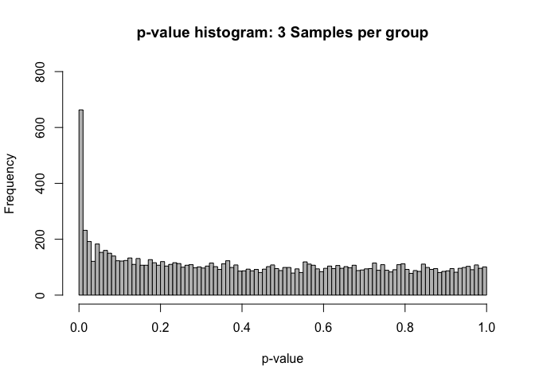

### **Top** differentially expressed genes

``` r
### helper functions to get gene information for a gene
### plot DESEQ2 object
deseq_gene_exp_plot <- function(deseq_obj, g_id, g_info){
      # plots gene expression counts by group variable
      # used in DESEQ2 object
      #
      # Arguments:
      #    deseq_obj: DESEQ2 object
      #    g_id:      ensembl gene ID
      #    g_info:    gene information dataframe
      #
      # Output:
      #     gene expression plot 
      #
      g_ind = which(as.vector(g_info$gene_id)==g_id)
      g_name = as.vector(g_info$gene_name)[g_ind]
      chro = as.vector(g_info$chr)[g_ind]
      data <- plotCounts(deseq_obj, gene=g_id, intgroup=c("group"), returnData=TRUE)
      p <- ggplot(data, aes(x=group, y=count, color=group))
      p <- p+ ggtitle(paste0(g_id,": ",g_name," Chr",chro))
      p <- p+ geom_point(position=position_jitter(width=.1,height=0), size=3)
      p <- p + theme(axis.text=element_text(size=12),              axis.title=element_text(size=20,face="bold", colour = "blue"), 
            plot.title = element_text(size=rel(1.5)))
      print(p)
}
```

``` r
#par(mfrow=c(2,3),las=1)
n=3
top_genes= rownames(resOrdered_3reps[1:n,])
for (i in 1:length(top_genes)){
  g_id = top_genes[i]
  deseq_gene_exp_plot(dds_3reps, g_id, gene_info)
}
```

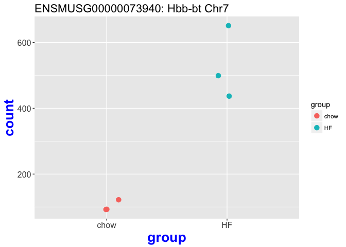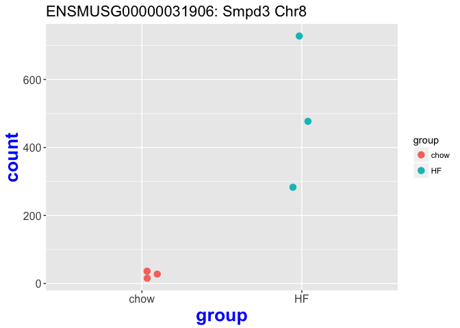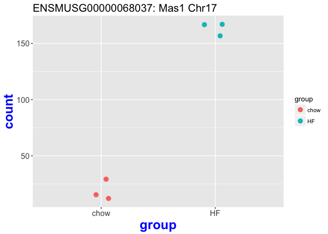

Differential Expression Analysis with **ten** samples in each **diet** group
----------------------------------------------------------------------------

``` r
sampleSize=10
diet_10 = c(male_chow_ids[1:sampleSize],male_hf_ids[1:sampleSize])
exp_design_diet_10 = exp_design %>% filter(Sample_ID %in% diet_10)
head(exp_design_diet_10)
```

    ##   Sample_ID Diet Sex
    ## 1      M326 chow   M
    ## 2      M327 chow   M
    ## 3      M328 chow   M
    ## 4      M329 chow   M
    ## 5      M330 chow   M
    ## 6      M331 chow   M

``` r
exp_diet_10=exp_all[,diet_10]
dim(exp_diet_10)
```

    ## [1] 21122    20

``` r
head(exp_diet_10)
```

    ##                         M326        M327      M328        M329      M330
    ## ENSMUSG00000051951    2.0000    0.000000    0.0000    0.000000    0.0000
    ## ENSMUSG00000025902   28.0000   30.000000   22.0000   19.000000   27.0000
    ## ENSMUSG00000098104    0.0000    1.025781    0.0000    1.019187    0.0000
    ## ENSMUSG00000033845  705.0000  634.006421  630.0000  626.000000  692.9662
    ## ENSMUSG00000025903 2637.2729 2587.214344 2470.1066 2718.405256 2227.8115
    ## ENSMUSG00000033813  978.4619 1108.673719  853.0824  958.614174 1122.8894
    ##                           M331        M332      M333      M334        M335
    ## ENSMUSG00000051951    2.000001    0.000000    0.0000    0.0000    0.000000
    ## ENSMUSG00000025902   47.000000   36.000000   25.0000   33.0000   30.000000
    ## ENSMUSG00000098104    1.028640    1.024341    0.0000    0.0000    1.035665
    ## ENSMUSG00000033845  689.000000  654.007901  469.0000  671.9106  580.276460
    ## ENSMUSG00000025903 2764.053805 2341.896904 1942.3996 2471.8835 2538.717853
    ## ENSMUSG00000033813  908.940465  809.121005  661.0976 1196.1387 1066.312021
    ##                         M351      M352      M353      M354      M355
    ## ENSMUSG00000051951    1.0000    1.0000    1.0000    0.0000    2.0000
    ## ENSMUSG00000025902   29.0000   29.0000   40.0000   14.0000   35.0000
    ## ENSMUSG00000098104    0.0000    0.0000    0.0000    0.0000    0.0000
    ## ENSMUSG00000033845  455.9880  493.0000  570.9945  375.0000  620.8904
    ## ENSMUSG00000025903 1734.1035 2078.5513 2393.5206 1720.1728 2459.1403
    ## ENSMUSG00000033813  652.5509  806.0604  676.5410  613.6654  735.8207
    ##                         M356        M357      M358      M359      M360
    ## ENSMUSG00000051951    3.0000    0.999999    0.0000    0.0000    1.0000
    ## ENSMUSG00000025902   30.0000   36.000000   16.0000   31.0000   24.0000
    ## ENSMUSG00000098104    0.0000    1.228979    0.0000    0.0000    0.0000
    ## ENSMUSG00000033845  687.0000  530.000001  442.4729  566.9779  450.0000
    ## ENSMUSG00000025903 2707.5965 2698.606475 2272.8827 2322.0693 1940.4030
    ## ENSMUSG00000033813  825.2811  960.904946  758.7697  843.7344  759.9141

``` r
all(colnames(exp_diet_10)==as.vector(exp_design_diet_10$Sample_ID))
```

    ## [1] TRUE

Let us filter out genes with zero and low expression (less than 5 read counts) in 50% of the samples.

``` r
threshold = 2000
head(exp_diet_10)
dim(exp_diet_10)
exp_mat_diet_10= as.data.frame(exp_diet_10) %>%
    rownames_to_column('gene_id') %>%
    filter(rowSums(.[,2:ncol(exp_diet_10)+1], na.rm=TRUE)>threshold) %>%
    column_to_rownames('gene_id')
dim(exp_mat_diet_10)
head(exp_mat_diet_10)
```

Let us create data frames for DESeq2 object

``` r
### colData contains the condition/group information for Differenetial expression analysis
colData <- DataFrame(group = factor(exp_design_diet_10$Diet))
```

``` r
### Create DESeq2 object using expression and colData
dds_10reps <- DESeqDataSetFromMatrix(countData = as.data.frame(round(exp_mat_diet_10)),
         colData = colData, design = ~ group)
dds_10reps <- estimateSizeFactors(dds_10reps)
counts_10reps= counts(dds_10reps, normalized=TRUE)
dds_10reps <- DESeq(dds_10reps)
res_10reps = results(dds_10reps)
resOrdered_10reps <- res_10reps[order(res_10reps$padj),]
head(resOrdered_10reps)
```

``` r
n=3
top_genes= rownames(resOrdered_10reps[1:n,])
par(mfrow=c(2,3),las=1)
for (i in 1:length(top_genes)){
  g_id = top_genes[i]
  deseq_gene_exp_plot(dds_10reps, g_id, gene_info)
}
```

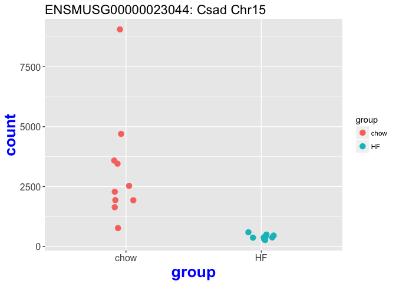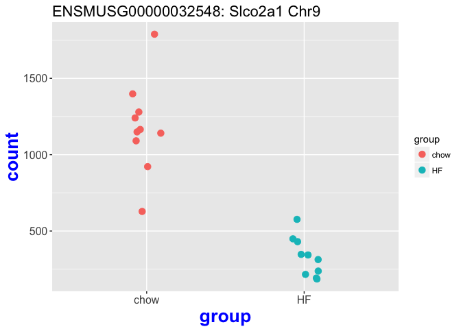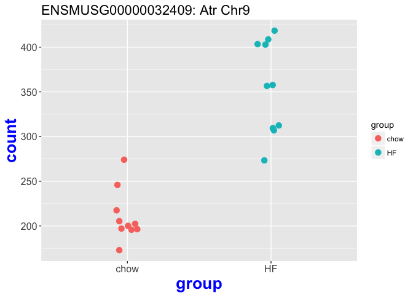

Differential Gene Expression Analysis Summary
---------------------------------------------

### P-value histogram comparison

``` r
par(mfrow=c(1,2))
hist(res_10reps$pvalue,breaks=100,col="grey", xlab="p-value",ylim=c(0,1000), main="p-value histogram: 10 Samples per group")
hist(res_3reps$pvalue,breaks=100,ylim=c(0,1000),col="grey", xlab="p-value",main="p-value histogram: 3 Samples per group")
```

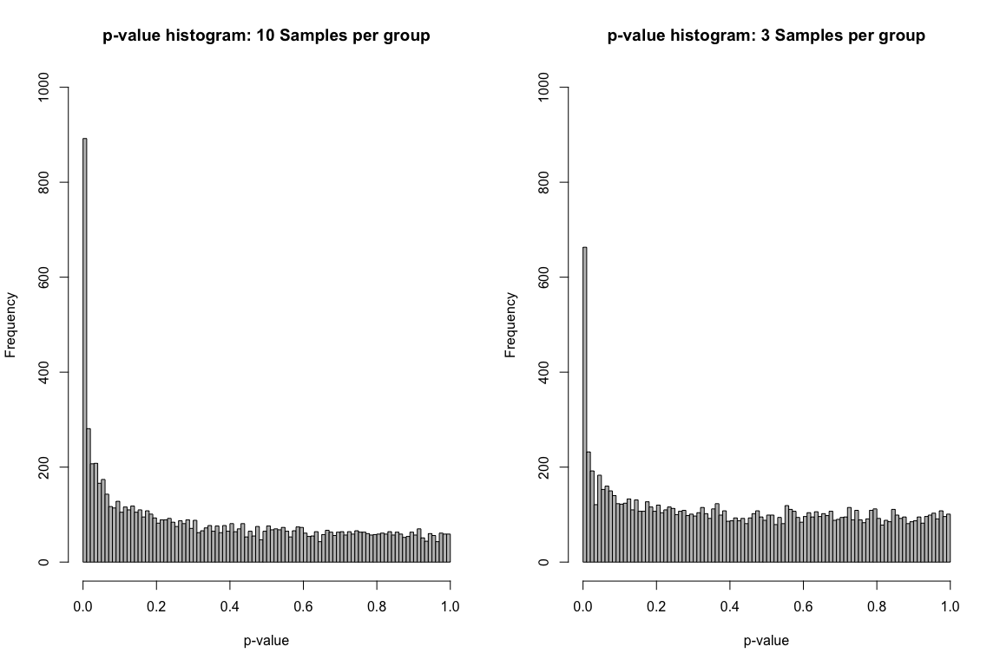

``` r
#rld_10reps <- rlog(dds_10reps, blind = FALSE)
#plotPCA(rld_10reps, intgroup = c("Diet"))
```

### DESEQ2 Summary: 3 samples per group

``` r
### summary of Differential Expression analysis
summary(res_3reps)
```

    ## 
    ## out of 11188 with nonzero total read count
    ## adjusted p-value < 0.1
    ## LFC > 0 (up)     : 275, 2.5% 
    ## LFC < 0 (down)   : 193, 1.7% 
    ## outliers [1]     : 46, 0.41% 
    ## low counts [2]   : 0, 0% 
    ## (mean count < 32)
    ## [1] see 'cooksCutoff' argument of ?results
    ## [2] see 'independentFiltering' argument of ?results

### DESEQ2 Summary: 10 samples per group

``` r
### summary of Differential Expression analysis
summary(res_10reps)
```

    ## 
    ## out of 8728 with nonzero total read count
    ## adjusted p-value < 0.1
    ## LFC > 0 (up)     : 496, 5.7% 
    ## LFC < 0 (down)   : 406, 4.7% 
    ## outliers [1]     : 0, 0% 
    ## low counts [2]   : 0, 0% 
    ## (mean count < 20)
    ## [1] see 'cooksCutoff' argument of ?results
    ## [2] see 'independentFiltering' argument of ?results

``` r
sig_genes_10reps = as.data.frame(res_10reps) %>% 
                  rownames_to_column('gene_id') %>%
                  filter(padj<0.1) %>% pull(gene_id)
length(sig_genes_10reps)
```

    ## [1] 902

``` r
length(union(sig_genes_10reps, sig_genes_3reps))
```

    ## [1] 1237

``` r
length(intersect(sig_genes_10reps, sig_genes_3reps))
```

    ## [1] 133

``` r
# Combining the two above..
comb <- unique(c(sig_genes_10reps, sig_genes_3reps))
length(comb)
```

    ## [1] 1237

``` r
# Comparing comb with the above two
sig_genes_10reps_2 <- comb %in% sig_genes_10reps
sig_genes_3reps_2 <- comb %in% sig_genes_3reps

# Generating venn counts to plot venn diagram
sig_genes <- cbind(sig_genes_10reps_2, sig_genes_3reps_2)
head(sig_genes)
```

    ##      sig_genes_10reps_2 sig_genes_3reps_2
    ## [1,]               TRUE             FALSE
    ## [2,]               TRUE             FALSE
    ## [3,]               TRUE             FALSE
    ## [4,]               TRUE             FALSE
    ## [5,]               TRUE             FALSE
    ## [6,]               TRUE              TRUE

``` r
sig_genes_counts <- vennCounts(sig_genes)

vennDiagram(sig_genes_counts, cex = 1,names = c("10 reps","3 reps"), circle.col = c("red", "blue"))
```

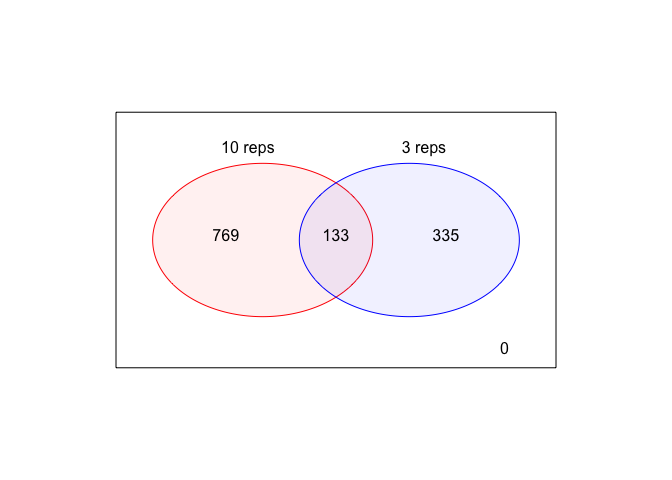
